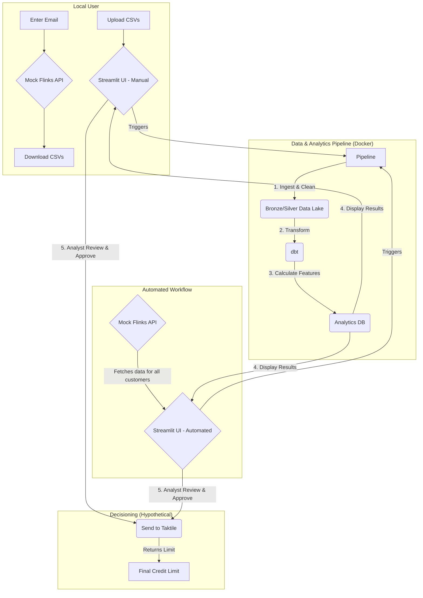

# Underwriting Analysis System

This project implements a robust, code-driven system that replicates and enhances a Google Sheet-based underwriting process. It is designed not just as a script, but as a prototype for a scalable, maintainable, and user-friendly data product.

## Architecture

The system is designed as a modern data pipeline with a clear separation of concerns, orchestrated within a containerized environment for consistency and ease of use.



## Key Features

*   **Mock Flinks API:** A simple Flask application that simulates a real-world banking API (`/api_mock`), allowing for the retrieval of customer statement data by email.
*   **Declarative Transformations:** A `dbt` project (`/analytics`) that handles all business logic, feature engineering, and data aggregation in a clean, modular, and testable way.
*   **Tiered Data Lake:** A structured data lake (`/data_lake`) with Bronze (raw) and Silver (cleaned) layers, built using the Delta Lake format for reliability and ACID transactions.
*   **Interactive Analyst UI:** A multi-page Streamlit application that provides two distinct workflows for underwriters, including data visualizations and a clear "human-in-the-loop" review step.
*   **Containerized Environment:** The entire application is containerized with Docker and orchestrated with `docker-compose`, ensuring a consistent, one-command setup for any user.

For a more detailed technical overview of the system architecture, components, and path-to-production strategy, please see the [Technical Reference](./docs/technical_reference.md).

## How to Run the System

**Prerequisites:**
*   Docker
*   `make`

From the root of the project directory, simply run:

```bash
make start
```

This command will build the necessary Docker images, start all services, and make the application available.

## User Workflows

Once the system is running, you can access the different components at the following URLs:

*   **Streamlit Analyst UI:** [http://localhost:8501](http://localhost:8501)
*   **dbt Documentation:** [http://localhost:8081](http://localhost:8081)
*   **Mock Flinks API (for exploration):** [http://localhost:5000](http://localhost:5000)

### Workflow 1: Manual Analysis for a Single Customer

This workflow allows an analyst to manually fetch statements for a specific customer and run them through the pipeline.

1.  **Fetch Statements:**
    *   Navigate to the Mock API at [http://localhost:5000](http://localhost:5000).
    *   Enter a customer email (e.g., `joelschaubel@gmail.com`) and click "Download Statements".
    *   Your browser will download a `.zip` file containing the statement CSVs. Unzip this file.
2.  **Run Analysis:**
    *   Navigate to the Streamlit UI at [http://localhost:8501](http://localhost:8501).
    *   On the **Manual CSV Upload** page, drag and drop the downloaded CSV files into the uploader.
    *   Click the "Run Analysis on Uploaded CSVs" button.
3.  **Review and Approve:**
    *   The application will display the results, including key metrics and visualizations.
    *   If you are comfortable with the analysis, you can click the "Generate Taktile API Payload" button to simulate sending the data to the decisioning engine.

### Workflow 2: Automated Analysis

This workflow simulates a more automated process, pulling data for a customer directly from the API.

1.  **Run Analysis:**
    *   Navigate to the Streamlit UI at [http://localhost:8501](http://localhost:8501).
    *   From the sidebar, navigate to the **Automated API Run** page.
    *   Enter the email of the customer you wish to analyze and click "Ingest from Mock API and Run Analysis".
2.  **Review and Approve:**
    *   The application will display the results just as in the manual workflow.
    *   Review the data and, if comfortable, simulate the call to the Taktile engine.

## Next Steps & Vision

This project provides a strong foundation. The next phase of work would focus on completing the underwriting logic and productionizing the system:

*   **dbt Feature Engineering:** Implement the remaining variables from the Underwriter Google Sheet as models in the dbt project.
*   **Taktile Integration:** Replace the "Simulate Payload" button with a real API call to a Taktile endpoint, which would receive the engineered features and return a final credit limit.
*   **Ledger Updates:** Update the `application_status_ledger` to `'COMPLETED'` or `'FAILED'` based on the result of the Taktile API call, providing full operational auditability.
