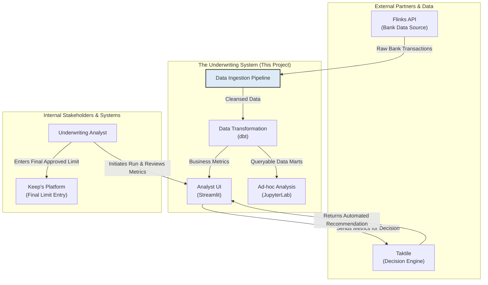

# System Architecture Diagram

This diagram provides a high-level overview of the components and data flow of the underwriting system.

```mermaid
graph TD
    subgraph "External Partners & Data"
        A["Flinks API<br>(Bank Data Source)"]
        B["Taktile<br>(Decision Engine)"]
    end

    subgraph "The Underwriting System (This Project)"
        style C fill:#DDEBF7,stroke:#333,stroke-width:2px
        C["Data Ingestion Pipeline"]
        D["Data Transformation<br>(dbt)"]
        E["Analyst UI<br>(Streamlit)"]
        F["Ad-hoc Analysis<br>(JupyterLab)"]
    end

    subgraph "Internal Stakeholders & Systems"
        G["Underwriting Analyst"]
        H["Keep's Platform<br>(Final Limit Entry)"]
    end

    A -- "Raw Bank Transactions" --> C
    C -- "Cleansed Data" --> D
    D -- "Business Metrics" --> E
    D -- "Queryable Data Marts" --> F
    
    G -- "Initiates Run & Reviews Metrics" --> E
    E -- "Sends Metrics for Decision" --> B
    B -- "Returns Automated Recommendation" --> E
    G -- "Enters Final Approved Limit" --> H
    
``` 
