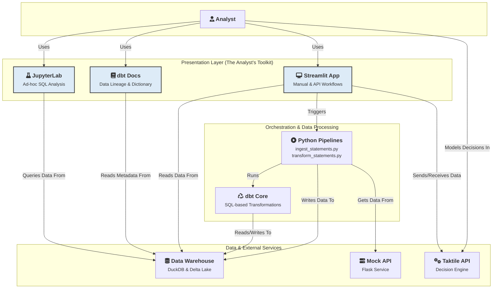

# A Vision for the Analyst-Driven Underwriting Workflow

The primary goal of this system is to empower the underwriting analyst. We move from a manual, error-prone spreadsheet process to a robust, transparent, and efficient code-driven workflow. The architecture is designed to give the analyst full control and deep insight at every step.

This diagram provides a detailed look inside the Underwriting architecture. It shows the specific components and tools that the analyst directly interacts with, the data stores that support them, and key external integrations.

