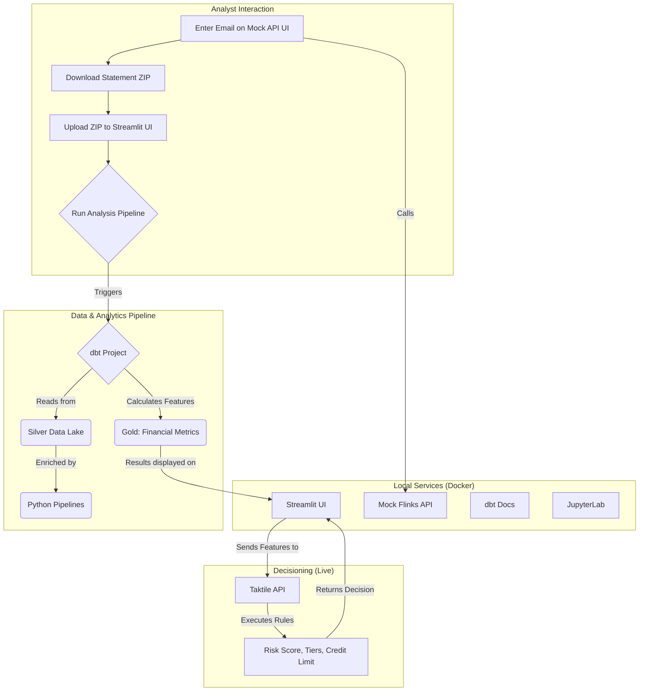

# Technical Reference: System Architecture

This document provides a more detailed, technical overview of the components and architecture of the underwriting analysis system.

## Architecture Diagram

## High-Level Architecture

The system is composed of four main components, each designed to be modular and independently scalable. This separation of concerns is key to the system's flexibility, allowing individual components to be upgraded or replaced without impacting the rest of the system.

### 1. Mock API (`api_mock`)

- **Purpose**: Mock implementation of a subset of the Flinks API. It allows a user to either access the frontend and download the CSV files for a given customer, or request the data via the API. For comprehensive API documentation with detailed endpoints and curl examples, see `docs/api_mock.md`.
- **Technology**: A Flask-based API that serves mock bank statement data from CSV files.
- **Production Strategy**: These pipelines can be easily migrated to a production environment and deployed on a cloud-based workflow orchestrator like Apache Airflow or Prefect. The data lake itself would be moved to a cloud storage solution like Amazon S3 or Google Cloud Storage.

### 2. Data Pipelines (`pipelines`)

- **Purpose**: A set of robust data pipelines responsible for ingesting, cleaning, and transforming the raw data into a usable format.
- **Technology**: The pipelines are built using Python with `deltalake` and `pandas`, processing data in stages and storing the output in a local, transactional data lake.
- **Architecture**: The data lake is located at the root directory at the location `data_lake/` and follows a standard multi-hop architecture:
    - **Bronze Layer**: Raw, unprocessed data is landed here from the source API.
    - **Silver Layer**: Data is cleaned, standardized, and enriched.
    - **Application Status Ledger**: A dedicated table (`application_status_ledger`) tracks the state of each application through the workflow.
- **Key Feature: Idempotency & ACID Transactions**: The entire data lake is built on **Delta Lake**. Instead of manual state management, the pipelines leverage atomic `MERGE` operations. This provides ACID guarantees and ensures that every pipeline run is idempotent, preventing data duplication and corruption. This is a modern, industry-standard approach to building reliable data platforms.
- **Production Strategy**: These pipelines can be easily migrated to a production environment and deployed on a cloud-based workflow orchestrator like Apache Airflow or Prefect. The data lake itself would be moved to a cloud storage solution like Amazon S3 or Google Cloud Storage.

### 3. Analytics (`analytics`)

- **Purpose**: This component is the feature engineering layer of the system. It is responsible for running analytics on the cleaned data to generate the core financial metrics required for the underwriting model.
- **Technology**: A dbt (Data Build Tool) project that uses DuckDB as its data warehouse. This allows for rapid, SQL-based development of data models and transformations. The output is a clean table (`fct_credit_metrics_by_customer`) that serves as the payload for the Taktile API.
- **Production Strategy**: In a production setting, this dbt project would be reconfigured to connect to a cloud data warehouse like Snowflake, BigQuery, or Redshift, enabling it to handle much larger datasets and more complex analytical workloads.

### 4. Taktile (Decisioning Engine)

- **Purpose**: Taktile serves as the live decisioning engine for the system. It receives the financial metrics from the dbt layer and executes all the complex business logic required to make a final credit decision.
- **Implementation**: The logic from the original Google Sheet—including risk scoring, tiering, guardrails, and the final credit limit calculation—has been fully implemented as a rules-based workflow in Taktile. This separation of concerns ensures that the business logic can be managed and updated by risk analysts without requiring changes to the underlying data pipelines.

## Next Steps & Vision

This project provides a strong, production-ready foundation. The architecture is complete and correctly implements the required logic. Future work could include:
*   **Ledger Updates:** Update the `application_status_ledger` to `'COMPLETED'` or `'FAILED'` based on the result of the Taktile API call, providing full operational auditability.
*   **Monitoring:** Add monitoring and alerting to the data pipelines to ensure data quality and timely execution.

## Path to Production

The current prototype is fully functional for local development and testing. The following steps outline the path to a full production deployment:

1.  **Swap the Mock API**: Reconfigure the API client to connect to the live Flinks API.
2.  **Deploy Pipelines**: Deploy the data pipelines to a workflow orchestrator like **Apache Airflow** for scheduled, reliable execution.
3.  **Scale the Data Lake**: Migrate the data lake from local storage to a cloud object store like **Amazon S3** or **Google Cloud Storage**.
4.  **Upgrade the Data Warehouse**: Transition the analytics from DuckDB to a production data warehouse like **Snowflake**, **BigQuery**, or **Redshift** to handle large-scale data.
5.  **Implement the Decisioning Logic**: Build out the Taktile integration to connect the feature data to the live decisioning engine. 
